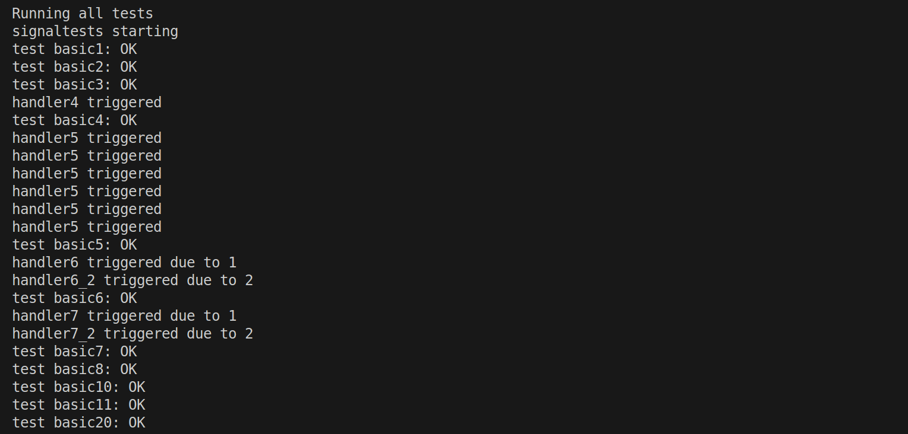

# OS-Project-Report

## 小组成员

| 姓名   | 学号     |
| ------ | -------- |
| 蔡骐骏 | 12210214 |
| 戚起宁 | 12212228 |
| 于斯瑶 | 12211655 |


## 设计架构

#### 1. 核心结构体

本模块依赖以下核心结构体：

- `struct ksignal`：表示一个进程的信号上下文，包含以下成员：
- `struct sigaction`
- `struct ucontext`：用于保存用户上下文，使得信号处理函数返回后可以恢复原先状态。

#### 2. 进程信号初始化函数

- `siginit(struct proc *p)`：初始化进程的信号处理结构。
- `siginit_fork(...)`：子进程继承父进程的信号处理行为（不继承 `sigpending`）。
- `siginit_exec(...)`：exec 调用后保留 `sigmask` 和 `sigpending`，重置除 `SIG_IGN` 外的处理器为默认。

#### 3. 信号处理函数

- `do_signal()`：内核在返回用户态之前调用该函数，以处理一个或多个未阻塞的、挂起的信号。

#### 4. 系统调用接口

- `sys_sigaction(...)`：提供用户注册和查询信号处理函数的系统调用接口。


## 实现功能

### Basic checkpoints

#### 1. 信号初始化（`siginit`、`siginit_fork`、`siginit_exec`）

- 所有信号初始时设置为默认处理（`SIG_DFL`）。
- 所有信号掩码清空。
- 子进程通过 `siginit_fork` 复制父进程的 `sigaction` 和 `sigmask`，但清空 `sigpending`，防止重复处理。
- `exec` 调用保留 `sigmask` 和 `sigpending`，但重置所有 `sigaction` 为默认行为（除 `SIG_IGN`）。

#### 2. 信号分发（`do_signal()`）

处理流程：

- 跳过被阻塞或未挂起的信号。
- 对 `SIGKILL`、`SIGSTOP`，直接终止进程，不允许被忽略或捕获。
- 对于可自定义处理的信号：
  - 将 `siginfo_t` 和 `ucontext` 写入用户栈。
  - 修改 `trapframe` 的 `epc`, `sp`, `a0~a2`, `ra` 以跳转执行信号处理函数。
  - 临时修改 `sigmask` 阻止信号重入。

#### 3. 用户注册处理函数（`sys_sigaction`）

- 校验信号合法性。

- `SIGKILL` 和 `SIGSTOP` 不允许设置为非默认处理，否则返回 `-EINVAL`。

- 支持保存旧的 `sigaction` 至 `oldact`。

- 从用户空间复制 `act` 至内核并保存。

  

### 5.3.2 SIGINFO

#### 用户进程的`siginfo`
在`sys_sigkill()`中，我们在checkpoint 1的基础上添加了`siginfo`.

- `siginfo.signo` 为信号的signo

- `siginfo.si_pid` 为发送信号的用户进程pid

- `siginfo`其他变量为0

```c
//sys_sigkill()

p->signal.siginfos[signo].si_signo = signo;
p->signal.siginfos[signo].si_code = 0; // 默认为0
p->signal.siginfos[signo].si_pid = curr_proc()->pid;
p->signal.siginfos[signo].si_status = 0;
p->signal.siginfos[signo].addr = 0;
```


#### 内核信号的`siginfo`
由于原代码中不涉及内核发送的信号，我们将`SIGUSR2`作为自定义的内核发出信号，并在系统调用中添加了`KTEST_SEND_SIGUSR2`作为用户进程主动请求

```c
uint64 ktest_syscall(uint64 args[6]) {
    uint64 which = args[0];
    switch (which) {
        // ...
        case KTEST_SEND_SIGUSR2:
            return sys_sigkill(args[1], SIGUSR2, 0);
    }
    return 0;
}
```

在发送时将pid置为-1
```c
//sys_sigkill()

//特殊处理: 内核发送的信号
if(signo == SIGUSR2) {
    p->signal.siginfos[signo].si_pid = -1;
    sigaddset(&p->signal.sigpending, signo);

    release(&p->lock);
    return 0;
}
```


### 5.3.3 SIGCHILD

在进程退出或者被杀死时，将会发送` SIGCHLD`到它的父进程。

```c
sys_sigkill(parent->pid, SIGCHLD, code);
```

在`sigkill`中，如果信号类型为`SIGCHLD`，将`p->signal.siginfos[signo].si_code `设为`code`，即进程退出码。同时如果父进程状态为`SLEEPING`，将父进程唤醒。

```C
if (signo == SIGCHLD)
{
    p->signal.siginfos[signo].si_code = code;

    sigaddset(&p->signal.sigpending, signo);
    if (p->state == SLEEPING) {
        p->state = RUNNABLE;
        add_task(p);
    }
    release(&p->lock);
    return 0;
}
```

在`do_signal`中，如果`sa->sa_sigaction`为`SIG_DFL`，即默认处理，则忽略信号。

```c
    if (signo == SIGCHLD && sa->sa_sigaction == SIG_DFL)
    {
        continue;
    }
```

如果不是，则进入用户注册的handler中进行处理。


### 5.3.4 SIGSTOP & SIGCONT

增加两种信号：`SIGSTOP` 和 `SIGCONT`。当前者被 delivered 到某个进程时，使其进入无限期暂停运行的状
态，直到 `SIGCONT` 被 delivered 到该进程。


```c
//do_signal()

if (signo == SIGSTOP) {
    sigdelset(&p->signal.sigpending, signo);
    p->need_stop = 1;
    continue;
}

if (signo == SIGCONT) {
    sigdelset(&p->signal.sigpending, signo);
    // 如果进程已经被SIGSTOP停止，恢复它
    if (p->state == STOPPED) {
        p->state = RUNNABLE;
    }
    // 清除need_stop标志，防止进程在返回用户态时被停止
    p->need_stop = 0;
    // 清除所有等待的SIGSTOP信号
    if (sigismember(&p->signal.sigpending, SIGSTOP)) {
        sigdelset(&p->signal.sigpending, SIGSTOP);
    }
    continue;
}
```


```c
//sys_sigkill()

// 特殊处理SIGSTOP信号
if (signo == SIGSTOP) {
    // SIGSTOP不能被阻塞或忽略
    // 不直接设置进程状态为STOPPED，而是设置pending信号
    // 让进程在do_signal中处理SIGSTOP信号时自行停止
    sigaddset(&p->signal.sigpending, signo);

    // 如果进程正在睡眠，唤醒它让它处理信号
    if (p->state == SLEEPING) {
        p->state = RUNNABLE;
        add_task(p);
    }
    
    debugf("proc %d received SIGSTOP via sys_sigkill", p->pid);
    release(&p->lock);
    return 0;
}

// 特殊处理SIGCONT信号
if (signo == SIGCONT) {
    sigaddset(&p->signal.sigpending, signo);
    // 清除need_stop标志，防止进程在返回用户态时被停止
    p->need_stop = 0;
    
    // 如果进程已经被SIGSTOP停止，恢复它
    if (p->state == STOPPED) {
        p->state = RUNNABLE;
        add_task(p);
    }
    
    // 清除所有等待的SIGSTOP信号
    if (sigismember(&p->signal.sigpending, SIGSTOP)) {
        sigdelset(&p->signal.sigpending, SIGSTOP);
    }
    
    release(&p->lock); // 释放在findByPid中获取的锁
    return 0;
}

```


## 测试截图

### checkpoint1&2&3



### 5.3.2 SIGINFO


### 5.3.3 SIGCHID


### 5.3.4 SIGSTOP & SIGCONT

